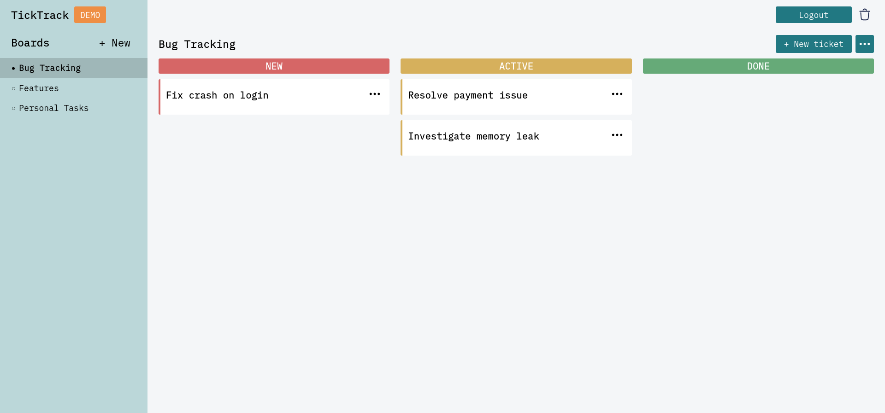
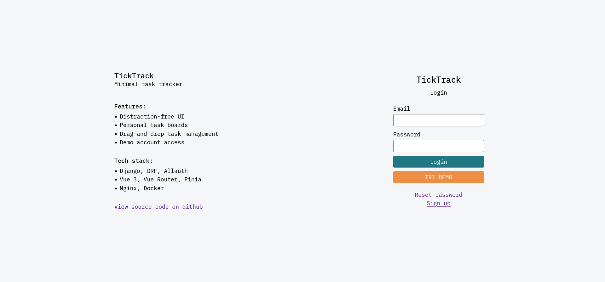

## Overview  
**TickTrack** is a simple kanban-style task management app.  
Users can create tasks organized into three columns (New, Active, Done) and manage them with drag and drop.  
Built with Django and Vue.  
## Demo  
Live: https://ticktrack.liashchevska.com/

The demo can be used without registration.

<details>
  <summary>Screenshots</summary>

  
  

</details>

## Features  
- Minimal, distraction-free UI
- Authentication
- Demo account for quick access without registration
- Kanban-style task board
- Drag-and-drop task management
## Tech Stack  
- **Backend:** Django, Django REST Framework, django-allauth
- **Database:** PostgreSQL
- **Frontend:** Vue 3, Pinia, Vue Router
- **Infrastructure:** Docker, Docker Compose, Nginx (reverse proxy), Certbot (HTTPS)
## Local Development  
To run locally, you need Docker and Docker Compose installed.  
Clone the repository:
```bash
git clone https://github.com/yourusername/ticktrack.git
cd ticktrack
```
Start the application using the development configuration:
```bash
docker compose -f dev.docker-compose.yaml up -d --build
```
`dev.env` already contains the required environment variables.  
The application will be available at http://localhost:5173
## Deployment  
The application is deployed using Docker Compose.  
- Nginx acts as a reverse proxy  
- HTTPS is handled with Certbot (Let’s Encrypt)  
- Frontend (Vue) and backend (Django REST API) run as separate services

Two cron jobs run on the server:  
- Cleanup of demo users  
- Automatic renewal of SSL certificates

Scripts are available in the `scripts/` folder.